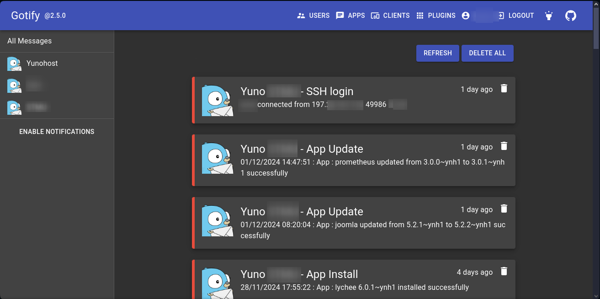

<!--
N.B.: README ini dibuat secara otomatis oleh <https://github.com/YunoHost/apps/tree/master/tools/readme_generator>
Ini TIDAK boleh diedit dengan tangan.
-->

# Yunohost_Gotify_Notifications untuk YunoHost

[](https://ci-apps.yunohost.org/ci/apps/yunohost_gotify_notifications/)


[](https://install-app.yunohost.org/?app=yunohost_gotify_notifications)

*[Baca README ini dengan bahasa yang lain.](./ALL_README.md)*

> *Paket ini memperbolehkan Anda untuk memasang Yunohost_Gotify_Notifications secara cepat dan mudah pada server YunoHost.*  
> *Bila Anda tidak mempunyai YunoHost, silakan berkonsultasi dengan [panduan](https://yunohost.org/install) untuk mempelajari bagaimana untuk memasangnya.*

## Ringkasan

# Yunohost_Gotify_Notifications
A collection of Yunohost webhooks to send notifications using Gotify

## Functions :
  * Get notified after adding a domain
  * Get notified after removing a domain
  * Get notified after a certificate update
  * Get notified after a backup is finished
  * Get notified after a restore is finished
  * Get notified after an app is installed
  * Get notified after an app is removed
  * Get notified after an app is updated
  * Get notified when a successful ssh connection is established


**Versi terkirim:** 0.1~ynh1

## Tangkapan Layar



## Dokumentasi dan sumber daya

- Dokumentasi pengguna resmi: <https://github.com/DeMiro5001/Yunohost_Gotify_Notifications/blob/main/README.md>
- Dokumentasi admin resmi: <https://github.com/DeMiro5001/Yunohost_Gotify_Notifications/blob/main/README.md>
- Depot kode aplikasi hulu: <https://github.com/DeMiro5001/Yunohost_Gotify_Notifications>
- Gudang YunoHost: <https://apps.yunohost.org/app/yunohost_gotify_notifications>
- Laporkan bug: <https://github.com/YunoHost-Apps/yunohost_gotify_notifications_ynh/issues>

## Info developer

Silakan kirim pull request ke [`testing` branch](https://github.com/YunoHost-Apps/yunohost_gotify_notifications_ynh/tree/testing).

Untuk mencoba branch `testing`, silakan dilanjutkan seperti:

```bash
sudo yunohost app install https://github.com/YunoHost-Apps/yunohost_gotify_notifications_ynh/tree/testing --debug
atau
sudo yunohost app upgrade yunohost_gotify_notifications -u https://github.com/YunoHost-Apps/yunohost_gotify_notifications_ynh/tree/testing --debug
```

**Info lebih lanjut mengenai pemaketan aplikasi:** <https://yunohost.org/packaging_apps>
